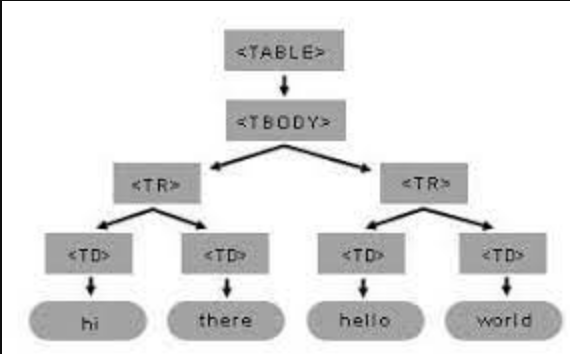

# dom

# WHAT IS DOM  IN JS?

# WHAT IS DOM?
- DOM, или Document Object Model, это программный интерфейс, который представляет структуру HTML-документа в виде объектов. Он позволяет     JavaScript взаимодействовать с элементами веб-страницы и изменять их содержимое, стили и атрибуты.

